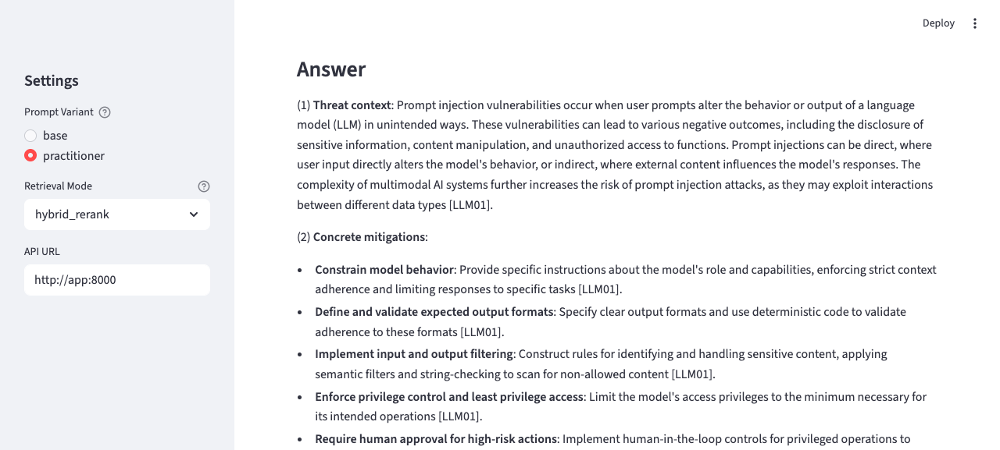
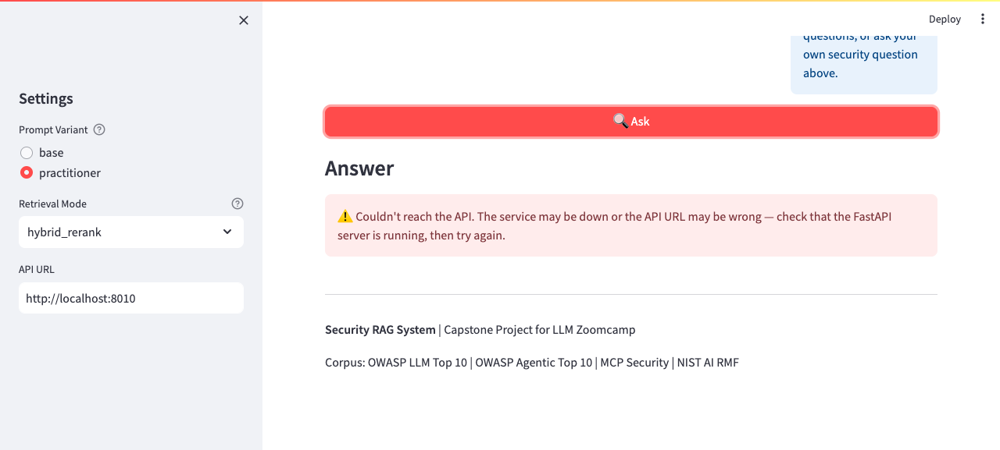
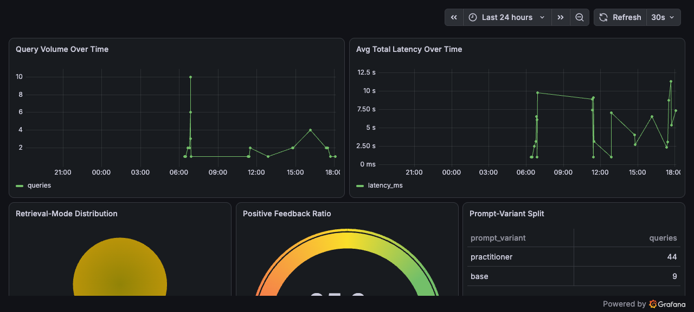
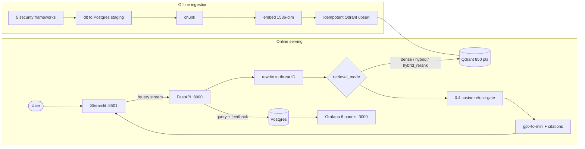

# Security RAG Assistant

**Security RAG Assistant** is a retrieval-augmented generation app that answers AI/LLM **security** questions grounded in authoritative frameworks — every answer is built from real retrieved source passages (not the model's parametric memory), tagged with threat IDs and citations. If nothing relevant is retrieved, it refuses ("not in the indexed sources") instead of guessing.

*LLM Zoomcamp 2026 capstone. Local Docker only (org policy — see [Tradeoffs](#limitations)); no hosted demo, so screenshots are below.*

---

## Problem

Security engineers reasoning about LLM/agent threats have to cross-reference several dense, fast-moving frameworks — OWASP's LLM Top 10 and Agentic Top 10, the Model Context Protocol spec and its security guidance, and the NIST AI RMF. A general chatbot answers confidently from parametric memory: it blends frameworks, invents threat IDs, and gives no way to check the source — the worst failure mode for a security decision. What's needed is an assistant that answers **only** from those authoritative documents, cites the exact threat ID and source, and says "I don't know" when the corpus doesn't cover the question. That grounding + refusal behavior is the point of this project.

## Demo

**Grounded answer with inline threat-ID citation** (`hybrid_rerank`, practitioner variant):



**Fail-visible when the API is down** — a red error, no stale/mock content, no fabricated citations:



(Live monitoring dashboard shown under [Monitoring](#monitoring).)

## Evaluation

Retrieval and generation are measured against a **78-pair, non-circular ground-truth set** generated from the live corpus (each pair stores the real Qdrant `chunk_id` it came from, so a retrieved hit counts as relevant iff its point `id` matches). One CSV feeds both eval lines. Full methodology and numbers: **[evaluation/EVALUATION.md](evaluation/EVALUATION.md)**.

**Retrieval** — hit-rate / MRR / precision@5 across all three modes:

| Mode | Hit Rate | MRR | Precision@5 |
|------|----------|-----|-------------|
| dense | 82.05% | 0.604 | 0.164 |
| hybrid | 84.62% | 0.702 | 0.169 |
| **hybrid_rerank** | **84.62%** | **0.773** | **0.169** |

`hybrid_rerank` wins on MRR (0.773) after tying hybrid on hit-rate, and is wired as the **production default** `retrieval_mode`. (Precision@5 is bounded at 0.2 with one gold chunk per question — MRR is the sharper signal here; explained in EVALUATION.md.)

**LLM-as-judge** — a `gpt-4o` judge (distinct from the `gpt-4o-mini` generator, to avoid circularity) scores both prompt variants 1-5 over the full retrieved context, backstopped by a 5-pair human spot-check:

| Variant | Accuracy | Completeness | Hallucination (grounded) |
|---------|----------|--------------|--------------------------|
| base | 4.79 | 4.53 | 4.85 |
| practitioner | 4.56 | 4.37 | 4.56 |

Rerun: `python -m evaluation.run_eval` (needs the stack up + `OPENAI_API_KEY`).

## Testing

```bash
pytest -q
```

84 tests over the load-bearing logic (rewriter, retrieval/RRF, reranking, evaluation metrics, persistence shaping, API contract, lifespan wiring). Offline the live-stack tests **skip cleanly and the suite exits 0** — the live probes require the stack up and an `OPENAI_API_KEY`. `tests/test_readme_honesty.py` mechanically guards this README (all 5 source IDs present, no committed key, every claimed bonus grep-matches `rag/`); `tests/test_compose_smoke.py` asserts the compose wiring.

## Monitoring

Every query and feedback vote persists to Postgres (`query_log`, `feedback_log`) via parameterized SQLAlchemy Core inserts run off the event loop. A `query_id` returned in the `X-Query-Id` response header ties each feedback row to its query. Grafana provisions a **6-panel dashboard** over the Postgres datasource. The FastAPI `/metrics` endpoint also exposes real Prometheus counters. Seed representative traffic with `python scripts/seed_queries.py`.



Panels: query volume over time, average latency, retrieval-mode distribution, positive-feedback ratio, prompt-variant split, and refusal rate.

## Quickstart (Docker)

Prereqs: Docker + Compose, and an OpenAI API key.

```bash
git clone <this-repo> && cd llm-zoomcamp-security-assistant
cp .env.example .env
# edit .env — set OPENAI_API_KEY
docker compose up            # docker-compose up also works
```

Ingestion runs automatically on first `up` (a one-shot `ingest` service the app/ui wait for) and **short-circuits on repeat runs** — no manual ingest step. Once healthy:

- UI: http://localhost:8501
- API: http://localhost:8000 (`/query`, `/feedback`, `/health`, `/metrics`)
- Grafana: http://localhost:3000 (`admin`/`admin` by default — local demo; override `GRAFANA_ADMIN_*` in `.env`)
- Qdrant: http://localhost:6333

## Data and configuration

The corpus is exactly these five sources (names as they appear in the ingestion registry and the eval set):

| Source | Contributes |
|--------|-------------|
| `owasp_llm_top_10` | LLM01–LLM10 threats + mitigations for LLM apps |
| `owasp_agentic_top_10` | ASI01–ASI10 threats for agentic systems |
| `mcp_protocol_spec` | Model Context Protocol architecture + capabilities |
| `mcp_security_docs` | MCP threat modeling + security best practices |
| `nist_ai_rmf` | NIST AI Risk Management Framework functions + controls |

Ingestion (`ingestion/run_pipeline.py`) fetches → stages in Postgres via **dlt** → chunks → embeds with `text-embedding-3-small` (1536-dim) → idempotently upserts into an **850-point** Qdrant collection (content-hash `uuid5` point IDs, so re-runs don't duplicate).

| Variable | Required | Description |
|----------|----------|-------------|
| `OPENAI_API_KEY` | **Yes** | Embeddings, generation (`gpt-4o-mini`), and the `gpt-4o` eval judge |
| `POSTGRES_URL` / `DLT_POSTGRES_*` | Yes (defaulted in compose) | dlt staging + query/feedback logs |
| `QDRANT_HOST` / `QDRANT_PORT` / `QDRANT_COLLECTION_NAME` | Defaulted | Vector store |
| `API_URL` | No (compose sets `http://app:8000`) | UI → API address |
| `GRAFANA_ADMIN_USER` / `GRAFANA_ADMIN_PASSWORD` | No (default `admin`) | Grafana login |

## Local run (no Docker)

Postgres and Qdrant must be reachable (the compose services, or your own):

```bash
python3.11 -m venv .venv && source .venv/bin/activate
pip install -r requirements.lock       # fully pinned, reproducible
python ingestion/run_pipeline.py       # populate Qdrant (idempotent)
uvicorn api.main:app --host 0.0.0.0 --port 8000
streamlit run ui/app.py                # in a second shell
```

## Architecture



Query path: **rewrite → retrieve → 0.4 cosine refuse-gate → stream a `gpt-4o-mini` answer with inline `[threat-ID]` citations.** Retrieval modes: **dense** (cosine baseline), **hybrid** (dense + BM25 fused with RRF, k=60), **hybrid_rerank** (hybrid → cross-encoder reranks the fused top-20 to top-5). The shared retriever + reranker are built once at FastAPI startup (lifespan) and reused across requests.

## Project structure

```
api/main.py            FastAPI: lifespan singletons, /query (stream), /feedback, /health, /metrics
rag/
  rewriter.py          free text -> canonical OWASP threat IDs (word-boundary, longest-match)
  retrieval.py         DenseRetriever, BM25, rrf_fuse, Reranker (cross-encoder)
  pipeline.py          rewrite -> retrieve -> gate -> generate orchestration
  generator.py         gpt-4o-mini streaming, base/practitioner prompt variants
ingestion/
  run_pipeline.py      dlt fetch -> chunk -> embed -> idempotent Qdrant upsert (+ ingest gate)
  dlt_sources/         one module per corpus   ·   transforms/  chunk + embed
evaluation/
  generate_qa.py       ground-truth Q&A from the live corpus
  eval_retrieval.py    hit-rate / MRR / precision@5    ·   eval_llm.py  gpt-4o judge
  run_eval.py          orchestrator -> EVALUATION.md   ·   ground_truth.csv, results/
monitoring/
  db.py                SQLAlchemy Core query_log + feedback_log   ·   logging.py, metrics.py
  grafana/provisioning/  datasource + 6-panel dashboard
ui/app.py              Streamlit chat: streaming, citations, feedback, fail-visible errors
tests/                 84 tests (unit + live-guarded)
docker-compose.yml     postgres · qdrant · ingest (one-shot) · app · ui · grafana
requirements.lock      fully pinned, reproducible build
```

## Decisions and trade-offs

- **`hybrid_rerank` as production default** because the eval measured it best (MRR 0.773 vs dense 0.604) — data-driven, not assumed. Cost: an ~80MB cross-encoder + rerank latency, loaded **once** at startup and shared.
- **Sync Qdrant client wrapped in `asyncio.to_thread`** rather than `AsyncQdrantClient`: keeps the tested retrieval path intact while staying off the event loop. The load-bearing requirement (clients + retriever built once, not per request) is met by lifespan injection.
- **SQLAlchemy Core (not the ORM)** for two append-only log tables — parameterized inserts, no ORM overhead, no migration framework (`create_all(checkfirst=True)`).
- **`gpt-4o` judge distinct from the `gpt-4o-mini` generator** to reduce self-grading circularity, plus a human spot-check as the real backstop.

## Limitations

- **Local Docker only** — no cloud deployment (org policy), so there's no hosted demo and the ~2-point cloud-deploy rubric line is deliberately forgone.
- **No auth, rate limiting, or prompt-injection guardrails** — a demo, not production (noted with the irony that the app is itself about LLM01). Prompt-injection surface is limited by treating retrieved context as data and the system prompt as authoritative, but full guardrails are out of scope.
- **precision@5 ≤ 0.2** by construction (one gold chunk per question) — informative only alongside MRR.
- **Single-user demo** — no accounts or session history; a single uvicorn worker keeps the Prometheus counters coherent.

## Future work

- Cloud deployment + CI (evals on PRs) if the hosting policy allows.
- A larger, multi-gold ground-truth set so precision/recall@k are more informative.
- Pin a cross-encoder `revision` SHA and pre-bake the model into the image for fully offline builds.

## Self-evaluation (LLM Zoomcamp rubric)

| Criterion | Evidence |
|-----------|----------|
| Problem description | [Problem](#problem) — grounded security Q&A with refusal |
| Retrieval flow (KB + LLM) | Qdrant KB + `gpt-4o-mini`; `rag/pipeline.py` |
| Retrieval evaluation | 3 modes compared, winner chosen; [Evaluation](#evaluation) |
| LLM evaluation | `gpt-4o` judge, both variants, human spot-check |
| Interface | Streamlit UI + FastAPI (`/query` streaming, `/feedback`) |
| Ingestion pipeline | Automated **dlt** pipeline (`ingestion/`) |
| Monitoring | Postgres + Grafana 6-panel dashboard + `/metrics` |
| Containerization | Full `docker-compose up` (6 services) |
| Reproducibility | `requirements.lock`, one-command up, documented steps |
| Best-practice bonuses | Hybrid search (`rrf_fuse`), cross-encoder rerank (`Reranker`), query rewriting (`QueryRewriter`) — all grep-verified in `rag/` |

## Secrets

No secrets are committed. `.env` is gitignored **and** excluded from the Docker build context via `.dockerignore` (so the key is never baked into an image layer); `.env.example` is a placeholder-only template; Compose injects the key at runtime via `env_file`. Never paste a real key into this repo.

## License

No license file yet — this is a course capstone submission. Add a `LICENSE` before any public release.
